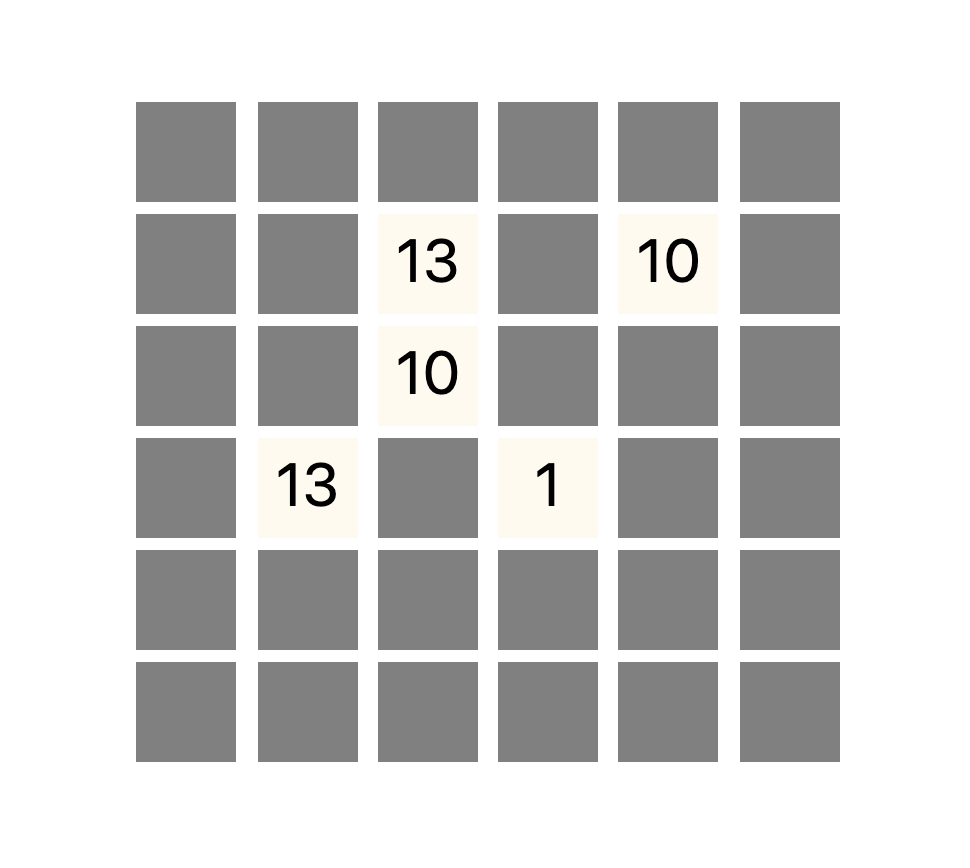

  
  

<h3 align="center">Matching Cards</h3>

---

 

      Simple Matching Cards Game

## 📝 Table of Contents

* [Getting Started](#getting_started)
* [Acknowledgments](#acknowledgement)

## 🏁 Getting Started 

* Just run index.html

  

## 🎉 Acknowledgements 

* Title icon made by [Freepik](https://www.flaticon.com/kr/authors/freepik).

* If you have a problem. please make [issue](https://github.com/da-huin/matching_cards/issues).

* Please help develop this project 😀

* Thanks for reading 😄
